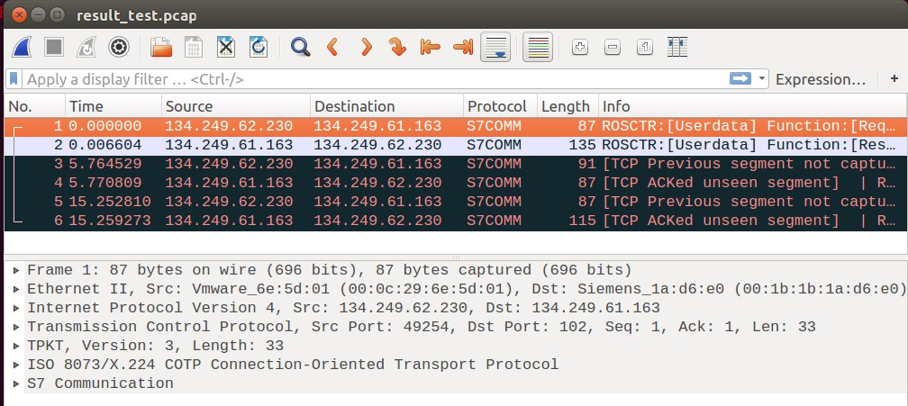

# s7-parser

S7 protocol (S7comm) parser using Libpcap. You can extract the S7 packets from a PCAP file with both IT and industrial protocols.


## Installation

```
apt install libpcap-dev
git clone https://github.com/ricardojoserf/s7-parser
cd s7-parser/
gcc s7.c -o s7parser -lpcap
```

## Usage

```
./s7parser $input_file $output_file
```

Testing with one of the test PCAP files in *s7_test/* :

```
./s7parser s7_test/password.pcapng result_test.pcap
```

The result is a PCAP with only the S7 extracted packets:




## Motivations

 - I realised the Wireshark filter did not recognise some S7 packets correctly.

 - I was unable to do this using scapy (the Python library) but I do not remember why.
 
 - I wanted to learn more about industrial protocols such as this (the code is probably worse than bad).


## References

- https://www.devdungeon.com/content/using-libpcap-c

- http://yuba.stanford.edu/~casado/pcap/section1.html

- http://yuba.stanford.edu/~casado/pcap/section4.html

- http://gmiru.com/article/s7comm/

- http://gmiru.com/article/s7comm-part2/
